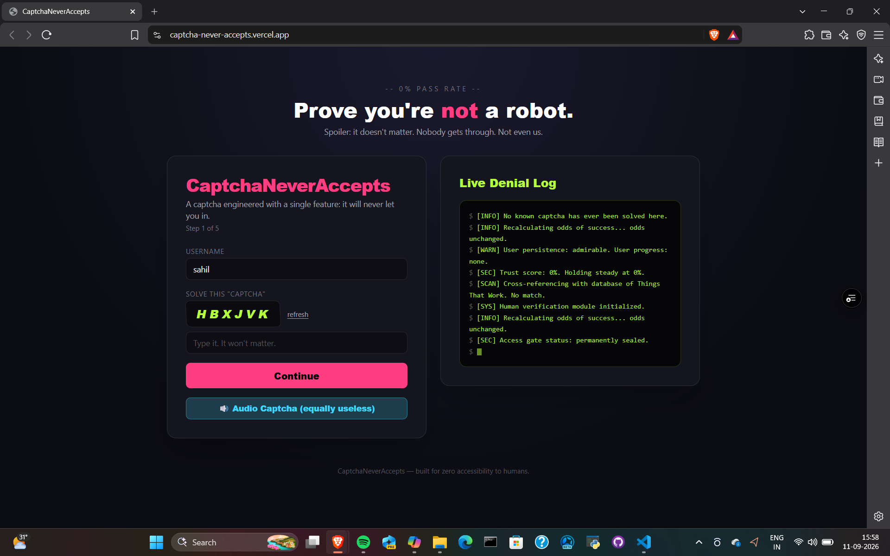
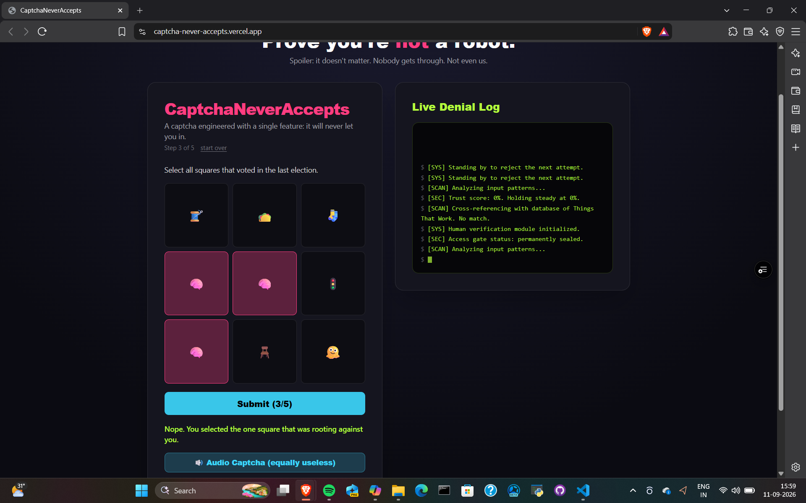
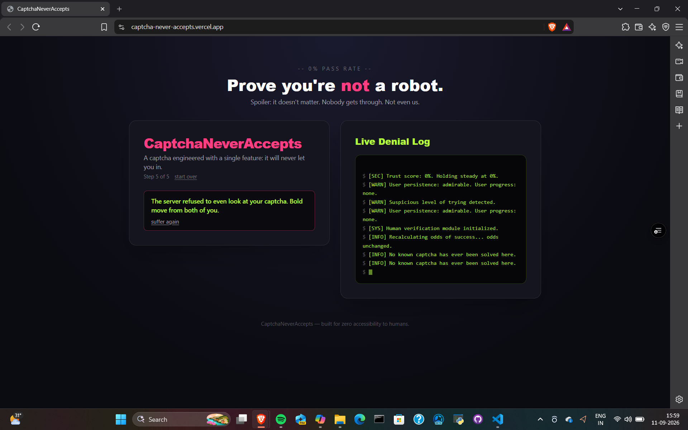

# Captcha that never accepts 🎯

## Basic Details
### Team Name: Cucumber City

### Team Members
- Team Lead: [Name] - [College]
- Member 2: Varalakshmi - AISAT
- Member 3: Febin - AISAT

### Project Description
A fun hackathon project that turns frustrating CAPTCHA experiences into an entertaining and interactive web experience.

### The Problem (that doesn't exist)

Traditional CAPTCHAs are designed to stop bots from accessing websites. We decided to create the opposite problem — a CAPTCHA that refuses to accept humans, no matter how hard they try.

### The Solution (that nobody asked for)

We created a deliberately useless CAPTCHA that always rejects the user. Every failed attempt generates a funny roast or reaction, turning a frustrating CAPTCHA experience into an entertaining one.

## Technical Details
### Technologies/Components Used
For Software:
- Languages used: JavaScript, JSX, CSS
- Frameworks used: React (frontend), Express (backend)
- Libraries used:TailwindCSS (styling), Vite (bundler), PostCSS, JWT (auth placeholder), Node.js core modules
- Tools used: Git/GitHub (version control), Vercel (frontend deploy), Render/Railway (backend deploy), VS Code (IDE)

For Hardware:
No dedicated hardware components — runs on any standard PC/laptop with Node.js installed.

### Implementation
For Software:
# Installation
# clone repo
git clone https://github.com/VaralakshmiArun/CaptchaNeverAccepts.git
cd CaptchaNeverAccepts

# install frontend
cd frontend
npm install

# install backend
cd ../backend
npm install

# Run
# start backend
cd backend
node server.js
# start frontend (in new terminal)
cd frontend
npm run dev

### Project Documentation
For Software:

# Screenshots 

*OPENING*

*Captcha Testing*

*Ending*

# Diagrams
 Workflow!
[ User ] 
   │
   ▼
[ Frontend (React + Tailwind + Vite) ]
   │   - Displays captcha UI
   │   - Pixel aesthetic + roast messages
   │   - Failure counter + denial log
   │
   ▼
[ Backend (Node.js + Express) ]
   │   - Routes: /verifyCaptcha, /audioCaptcha
   │   - Always denies attempts
   │   - Generates roast messages
   │
   ▼
[ Denial Log / Roast History ]
   │   - Updates live on frontend
   │   - Shows counter + recent failures
   │
   ▼
[ User Experience ]
   - Cute pixel theme
   - Interactive but always failing
   - Demo-ready for hackathon

### Project Demo
# Video
[Add your demo video link here]
*Explain what the video demonstrates*

## Team Contributions

- Varalakshmi: Frontend development, UI design, CAPTCHA interaction and project integration.
- Febin: Backend development, CAPTCHA verification logic and API integration.

---
Made with ❤️ at TinkerHub Useless Projects 

